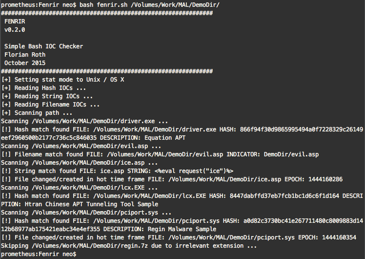
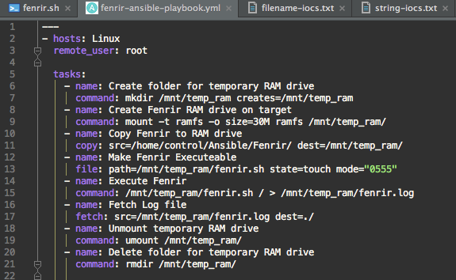

# Fenrir
Simple Bash IOC Scanner

Fenrir is a simple IOC scanner bash script. It allows scanning Linux/Unix/OSX systems for the following Indicators of Compromise (IOCs):
- Hashes

   MD5, SHA1 and SHA256 (using md5sum, sha1sum, sha -a 256)

- File Names 

   string - checked for substring of the full path, e.g. "temp/p.exe" in "/var/temp/p.exe"

- Strings

   grep in files

- Hot Time Frame

   using stat in different modes - define min and max epoch time stamp and get all files that have been created in between

# Why Fenrir?
FENRIR is the 3rd tool after THOR and LOKI. [THOR](http://www.bsk-consulting.de/apt-scanner-thor/) is our full featured APT Scanner with many modules and export types for corporate customers. [LOKI](https://github.com/Neo23x0/Loki) is a free and open IOC scanner that uses [YARA](https://plusvic.github.io/yara/) as signature format. 

The problem with both predecessors is that both have certain requirements on the Linux platform. We build THOR for a certain Linux version in order to match the correct libc that is required by the YARA module. LOKI requires Python and YARA installed on Linux to run.

We faced the problem of checking more than 100 different Linux systems for certain Indicators of Compromise (IOCs) without installing an agent or software packages. We already had an [Ansible](http://www.ansible.com/) playbook for the distribution of THOR on a defined set of Linux remote systems. This playbook creates a RAM drive on the remote system, copies the local program binary to the remote system, runs it and retrieves the logs afterwards. This ensures that the program's footprint on the remote system is minimal. I adapted the Ansible playbook for Fenrir.

Fenrir is still 'testing'. Please report back errors (and solutions) via the "Issues" section here on github. 

If you find a better / more solid / less error-prone solution to the evaluations in the script, please report them back. I am not a full-time bash programmer so I'd expect some room for improvement. 

# Usage

```
Usage: ./fenrir.sh DIRECTORY
 
DIRECTORY - Start point of the recursive scan
```

All settings can be configured in the header of the script.


# Step by Step

What Fenrir does is:
- Takes a parameter as starting directory for the recursive walk
- Checks for directory exclusions (configurable in the script header)
- Checks for certain file extensions to check (configurable in the script header)
- Checks the file name (full path) for matches in IOC files
- Checks for file size exclusions (configurable in the script header)
- Checks for certain strings in the file (via grep)
- Checks for certain hash values 
- Checks for change/creation time stamp 

# Screenshots

Scan Run showing the different match types on a demo directory. 



Configuration


Ansible Playbook



# Contact 

via Twitter @Cyb3rOps
